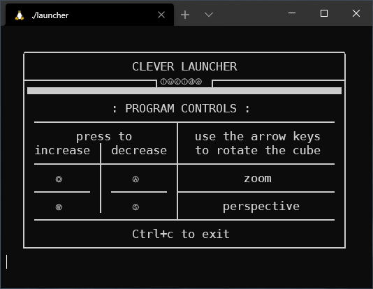

# WireframeAscii

  

## What's this?

A tiny ascii 3d engine written in C. It's a project I made when I was 16.

By that time we had already seen `struct`s in class, and the school year was about to end. This one was prototyped in [Scratch](https://scratch.mit.edu/) and then ported to C.

I discovered the [Bresenham's line rasterization algorithm](https://en.wikipedia.org/wiki/Bresenham%27s_line_algorithm) while working on this. And talking about rasterization, everything appears stretched out vertically because I treated chars as square pixels, when they are actually rectangular.

A fun fact about this project, is that it implements something resembling a copy protection, to prevent unauthorized copying.\
It was comprised of the program itself and a launcher: the launcher would generate a string written to a file. The program would then generate a new string using the same algorithm, and if the two strings matched, the program would start successfully. If someone tried to blindly copy the program's source, it wouldn't have worked.

It's a fun fact because that didn't technically provide any copy protection whatsoever. And there were no need to anyway: by the time I released this, everyone already knew I made fancy text graphics.\
But it was an interesting detour nonetheless.

## Features

* completely written in [Geany](https://www.geany.org/) on a Ubuntu VM
* screen still cleared with `system("clear")`, *ouch*!
* perspective controls, *math*!
* quirky DRM

  

## Curator

* UNIX project
* CMake scripts have been added
* launcher was edited to launch one executable only
